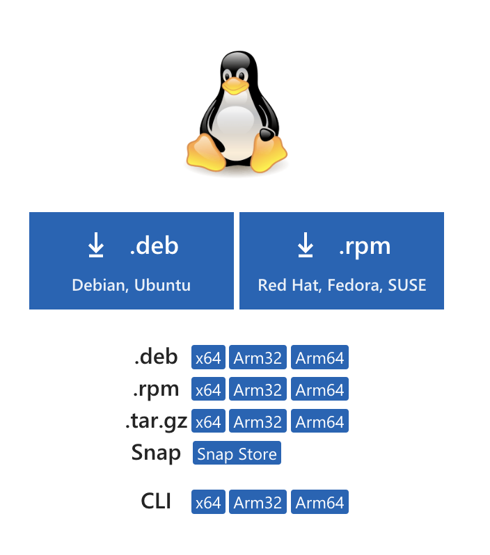

## Introduction

This lab will get you familiar with the VM Sandbox environment, creating a CentOS VM and a Window VM.

Firefox is recommended for all labs. Please note, while the VM Sandbox environment is very robust, it is not perfect. Do not expect high level of performance and anticipate that there might be some latency issues, especially if you are working off-campus.

Setting-up Virtual Machines for this Class

First, login to <https://sandbox02.cech.uc.edu/vcac/>

Select the domain "ad.uc.edu" and click Next.


Sign in with your UC username and password.


Click the "Deployments" tab, which will contain all of your requests. Select your "Scripting Language" Deployment


## Linux Setup and Validation

Let's select the CentOS server first. Hover over the machine and click the blue gear icon. Click "Connect Using Remote Console"


Click into the window and press `ENTER` to show the login prompt.
Login using the following credentials:

- Localhost login: `student`
- Password: `Pa$$w0rd`

Click Applications | Terminal


Go ahead and run this command:

```bash
sudo su
```

Enter the password above once again.
Now run some of these commands:

```bash
ping www.uc.edu
```

A proper ping response confirms we have an internet connection. Press ctrl-c to end the ping.

Run the command

```bash
ip a
```

You should see results similar to what's below.


While we're at it, let's go ahead and change the hostname of your Linux VM. Call is the same name you called your VM when we provisioned it (eg. reedws-centos)

To change it,

```bash
hostnamectl set-hostname reedws-centos ### replace reedws with your username
```

Follow this up with a reboot to finalize both our network and hostname settings.

```bash
reboot
```

That'll do it for our CentOS setup for now. Let's switch to Windows.

### Linux Software

Let's install all of the software we're going to need for our class. Please install all software with it's default options.

#### Git

```bash
sudo yum groupinstall "Development Tools"
git config user.email "username@abc.example" --global  ### replace email with the one on your github account
git config user.name "Your Name" --global
```

#### VS Code

Download and install VSCode from <https://code.visualstudio.com/download> and choose the link for the .rpm installer.



Then open a terminal and run the following commands:

```bash
sudo rpm -i /path/to/code.rpm
```

## Windows Setup

Click the Blue Gear icon next to our Windows machine. Again, click "Connect using Remote Console"


At the login prompt, login as:

- User: `Administrator`
- Password:`Pa$$w0rd`

Click the Start Menu and type PowerShell to launch the PowerShell window.


First, confirm we have an IP address.

```powershell
ipconfig
```


Also confirm we can ping a website.

```powershell
ping www.uc.edu
 ```


And why don't we confirm that we can ping our linux machine. You can get the IP address from the ip addr command that we ran above (hint: it starts with 192.)

```powershell
ping 192.168.33.4    # This will be different for you
```


Finally, let's change our Windows hostname as well:

```powershell
rename-computer reedws-win    ### replace reedws with your username
```

Now, restart your Windows machine

```powershell
shutdown -r
```

Once rebooted, please take a snapshot of each one of your VMs. From the blue gear menu, click "Create Snapshot". Give it a name if you want, and click Submit. Do this on both your Windows and Linux VMs.


