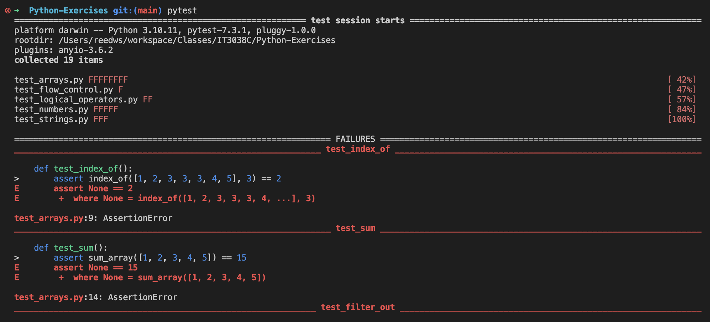

Below are a couple of examples for how you should go about this assignment.

## Example 1:
### Setup
1. Navigate to your repository in the command line.
  - You can either use the `cd PATH_TO_FOLDER` command.
    - In my case the command was `cd /Users/wesreed/git/School/IT3049/Python-Exercises`
    - Use the `pwd` command to **P**rint **W**orking **D**irectory and confirm your location
  - **OR** You could open VSCode integrated terminal window and it will open in the terminal already in the right path.
2. Installing the dependencies `pip install -r requirements.txt`
3. Run the tests using `pytest`.

  
  - Notice all the errors, our goal for this assignment is to resolve them all.

### Getting Down to Business
1. Open the project in *Visual Studio Code* (Not Visual Studio)
    

    **Let's try to solve a couple of those tests.**

2. Open the file `numbers_1.py`. Particularly
    ```python
    # parse_int: should convert strings to integer numbers
    def parse_int (str):
      return
    ```
    - Notice the function have an empty implementation. - We need to do something about that 🤔

3. Consulting the [Python documentation for built-in functions](https://docs.python.org/3.10/library/functions.html?highlight=int#int). The documentations shows usage examples, and specifies the parameters and return type of the function.

    

    **Key Takeaways:**
      ```python
        # parse_int: should convert strings to integer numbers
        def parse_int (str):
          return int(str)
      ```
      - Don't forget to `return` something from the function.
4. Re-run the tests again and let's see if it passes

    

5. Commit your code  `git commit -m "finished test parseInt"`.

________________

## Example 2:
1. Well, no need for the setup steps here (you should already be in the directory)
2. Open the file `lists_3.py`. Particularly at this function
    ```python
      '''
      IndexOf: you should be able to determine the location of an item in an list
      Example:
      arr = [1,2,3,5,6]
      calling the function like
      index_of(arr, 3) should return the index 2
      '''
      def index_of(arr, item):
          return
    ```
3. The `index_of` method is supposed to return the index of a certain element in a list. [You can learn more about Python Built-in method here](https://docs.python.org/3.10/library/array.html?highlight=inde#array.array.index)
4. My implementation for this is as follows
  ```python
    def index_of(arr, item):
      return arr.index(item)
  ```
5. Re-run the tests again and let's see if it passes
6. Commit your code  `git commit -m "finished test: IndexOf"`.


**On to the next test .. Rinse 🧼 and Repeat 🔁**
